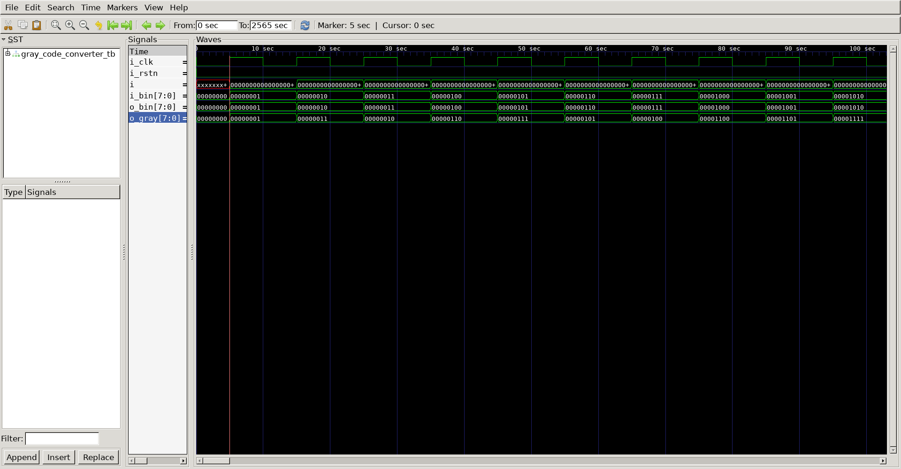

# Gray Code Converter
## Operation Principle

- Binary -> Gray
	- G[N-1] = B[N-1]
	- G[I]	 = B[I+1] ^ B[I]

- Gray -> Binary
	- B[N-1] = G[N-1]
	- B[I]	 = G[I] ^ B[I+1]

## Verilog Code
### DUT
```verilog

module bin_to_gray
#(
	parameter 	BIT	= 8
)
(
	output 	[BIT-1:0]	o_gray,
	input	[BIT-1:0]	i_bin
);

	`ifdef GENER_TO_GRAY
		genvar	g;
		generate
			for (g=0; g<BIT; g++) begin
				assign	o_gray[g]	= i_bin[g+1] ^ i_bin[g]; 
			end
		endgenerate
		assign	o_gray[BIT-1]	= i_bin[BIT-1]; 			// MSB

	`else
		assign	o_gray[0]	= i_bin[1] ^ i_bin[0];
		assign	o_gray[1]	= i_bin[2] ^ i_bin[1];
		assign	o_gray[2]	= i_bin[3] ^ i_bin[2];
		assign	o_gray[3]	= i_bin[4] ^ i_bin[3];
		assign	o_gray[4]	= i_bin[5] ^ i_bin[4];
		assign	o_gray[5]	= i_bin[6] ^ i_bin[5];
		assign	o_gray[6]	= i_bin[7] ^ i_bin[6];
		assign	o_gray[7]	= i_bin[7]; 					// MSB
	`endif

endmodule

module gray_to_bin
#(
	parameter 	BIT	= 8
)
(
	output	[BIT-1:0]	o_bin,
	input	[BIT-1:0]	i_gray
);

	`ifdef GENER_TO_BIN
		genvar	g;
		generate
			for (g=0; g<BIT; g++) begin
				assign	o_bin[g]	= o_bin[g+1] ^ i_gray[g]; 
			end
		endgenerate
		assign	o_bin[BIT-1]	= i_gray[BIT-1]; 			// MSB

	`else
		assign	o_bin[0]	= o_bin[1] ^ i_gray[0];
		assign	o_bin[1]	= o_bin[2] ^ i_gray[1];
		assign	o_bin[2]	= o_bin[3] ^ i_gray[2];
		assign	o_bin[3]	= o_bin[4] ^ i_gray[3];
		assign	o_bin[4]	= o_bin[5] ^ i_gray[4];
		assign	o_bin[5]	= o_bin[6] ^ i_gray[5];
		assign	o_bin[6]	= o_bin[7] ^ i_gray[6];
		assign	o_bin[7]	= i_gray[7]; 					// MSB
	`endif

endmodule
```

### Testbench
```verilog

`define CLKFREQ		100
`define SIMCYCLE	256
`define BIT			8

`define GENER_TO_GRAY
`define GENER_TO_BIN

`include "gray_code_converter.v"

module gray_code_converter_tb;
	
	wire	[`BIT-1:0]	o_gray;
	wire	[`BIT-1:0]	o_bin;
	reg	[`BIT-1:0]	i_bin;
	reg			i_clk;
	reg			i_rstn;

	bin_to_gray
	#(
		.BIT		(`BIT)
	)
	u_bin_to_gray(
		.o_gray		(o_gray),
		.i_bin		(i_bin)
	);

	gray_to_bin
	#(
		.BIT		(`BIT)
	)
	u_gray_to_bin(
		.o_bin		(o_bin),
		.i_gray		(o_gray)
	);

	always	#(500/`CLKFREQ)		i_clk = ~i_clk;


	task init;
		begin
			i_bin	=	0;
			i_clk	=	0;
			i_rstn	=	0; 
			@(posedge i_clk);
		end
	endtask


	integer	i;
	initial begin
		init();
		
		for (i=0; i<`SIMCYCLE; i++) begin
			i_bin	= i_bin + 8'b1;
			@(posedge i_clk);
		end

		$finish;
	end

	reg [8*32-1:0] vcd_file;
	initial begin
		if($value$plusargs("vcd_file=%s", vcd_file)) begin
			$dumpfile(vcd_file);
			$dumpvars;
		end else begin
			$dumpfile("gray_code_converter.vcd");
			$dumpvars;
		end
	end

endmodule
```

## Simulation Result


