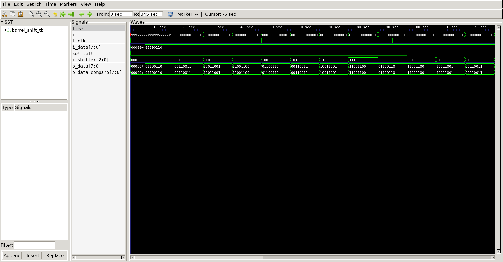
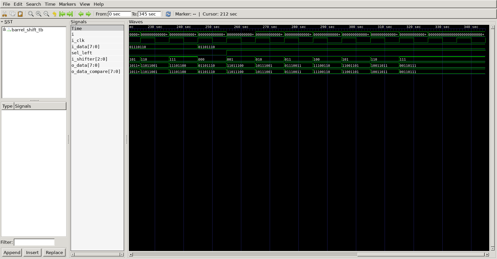

# Barrel Shift
## Operation Principle
- 8-bit Barrel Shifter

- i_shifter : rotate amount
- sel_left  : rotate direction

## Verilog Code
### DUT
```verilog

module barrel_shift
#(
	parameter	BIT		= 8
)
(
	output 		[BIT-1:0]			o_data,
	input		[BIT-1:0]			i_data,
	input							sel_left,
	input		[$clog2(BIT)-1:0]	i_shifter
);

	assign 		o_data	=	sel_left ? (i_data << i_shifter) | (i_data >> (BIT-i_shifter)) :
	                                   (i_data >> i_shifter) | (i_data << (BIT-i_shifter)); 

endmodule

module barrel_shift_compare
#(
	parameter	BIT		= 8
)
(
	output 		[BIT-1:0]			o_data,
	input		[BIT-1:0]			i_data,
	input							sel_left,
	input		[$clog2(BIT)-1:0]	i_shifter
);
	wire		[BIT-1:0]			i_start_data;
	wire		[BIT-1:0]			first_data;
	wire  		[BIT-1:0]			mid_data;
	wire		[$clog2(BIT)-1:0]	sel;

	assign	i_start_data[0]	= (sel_left == 1) ? i_data[1] : i_data[0];
	assign	i_start_data[1]	= (sel_left == 1) ? i_data[2] : i_data[1];
	assign	i_start_data[2]	= (sel_left == 1) ? i_data[3] : i_data[2];
	assign	i_start_data[3]	= (sel_left == 1) ? i_data[4] : i_data[3];
	assign	i_start_data[4]	= (sel_left == 1) ? i_data[5] : i_data[4];
	assign	i_start_data[5]	= (sel_left == 1) ? i_data[6] : i_data[5];
	assign	i_start_data[6]	= (sel_left == 1) ? i_data[7] : i_data[6];
	assign	i_start_data[7]	= (sel_left == 1) ? i_data[0] : i_data[7];

	assign  sel[2]			= sel_left ^ i_shifter[2]; 
	assign  sel[1]			= sel_left ^ i_shifter[1]; 
	assign  sel[0]			= sel_left ^ i_shifter[0]; 

	assign	first_data[0]	= (sel[2] == 1) ? i_start_data[4] : i_start_data[0];
	assign	first_data[1]	= (sel[2] == 1) ? i_start_data[5] : i_start_data[1];
	assign	first_data[2]	= (sel[2] == 1) ? i_start_data[6] : i_start_data[2];
	assign	first_data[3]	= (sel[2] == 1) ? i_start_data[7] : i_start_data[3];
	assign	first_data[4]	= (sel[2] == 1) ? i_start_data[0] : i_start_data[4];
	assign	first_data[5]	= (sel[2] == 1) ? i_start_data[1] : i_start_data[5];
	assign	first_data[6]	= (sel[2] == 1) ? i_start_data[2] : i_start_data[6];
	assign	first_data[7]	= (sel[2] == 1) ? i_start_data[3] : i_start_data[7];

	assign	mid_data[0]		= (sel[1] == 1) ? first_data[2] : first_data[0];
	assign	mid_data[1]		= (sel[1] == 1) ? first_data[3] : first_data[1];
	assign	mid_data[2]		= (sel[1] == 1) ? first_data[4] : first_data[2];
	assign	mid_data[3]		= (sel[1] == 1) ? first_data[5] : first_data[3];
	assign	mid_data[4]		= (sel[1] == 1) ? first_data[6] : first_data[4];
	assign	mid_data[5]		= (sel[1] == 1) ? first_data[7] : first_data[5];
	assign	mid_data[6]		= (sel[1] == 1) ? first_data[0] : first_data[6];
	assign	mid_data[7]		= (sel[1] == 1) ? first_data[1] : first_data[7];

	assign	o_data[0]		= (sel[0] == 1) ? mid_data[1] : mid_data[0];
	assign	o_data[1]		= (sel[0] == 1) ? mid_data[2] : mid_data[1];
	assign	o_data[2]		= (sel[0] == 1) ? mid_data[3] : mid_data[2];
	assign	o_data[3]		= (sel[0] == 1) ? mid_data[4] : mid_data[3];
	assign	o_data[4]		= (sel[0] == 1) ? mid_data[5] : mid_data[4];
	assign	o_data[5]		= (sel[0] == 1) ? mid_data[6] : mid_data[5];
	assign	o_data[6]		= (sel[0] == 1) ? mid_data[7] : mid_data[6];
	assign	o_data[7]		= (sel[0] == 1) ? mid_data[0] : mid_data[7];

endmodule

module barrel_shift_mux
#(
	parameter	BIT		= 8
)
(
	output 		[BIT-1:0]			o_data,
	input		[BIT-1:0]			i_data,
	input		[$clog2(BIT)-1:0]	i_shifter
);
	wire  		[BIT-1:0]			mid_data1;
	wire  		[BIT-1:0]			mid_data2;

	mux2 u_mux2_r4_0(mid_data1[0], i_shifter[2], i_data[0], i_data[4]);
	mux2 u_mux2_r4_1(mid_data1[1], i_shifter[2], i_data[1], i_data[5]);
	mux2 u_mux2_r4_2(mid_data1[2], i_shifter[2], i_data[2], i_data[6]);
	mux2 u_mux2_r4_3(mid_data1[3], i_shifter[2], i_data[3], i_data[7]);
	mux2 u_mux2_r4_4(mid_data1[4], i_shifter[2], i_data[4], i_data[0]);
	mux2 u_mux2_r4_5(mid_data1[5], i_shifter[2], i_data[5], i_data[1]);
	mux2 u_mux2_r4_6(mid_data1[6], i_shifter[2], i_data[6], i_data[2]);
	mux2 u_mux2_r4_7(mid_data1[7], i_shifter[2], i_data[7], i_data[3]);

	mux2 u_mux2_r2_0(mid_data2[0], i_shifter[1], mid_data1[0], mid_data1[2]);
	mux2 u_mux2_r2_1(mid_data2[1], i_shifter[1], mid_data1[1], mid_data1[3]);
	mux2 u_mux2_r2_2(mid_data2[2], i_shifter[1], mid_data1[2], mid_data1[4]);
	mux2 u_mux2_r2_3(mid_data2[3], i_shifter[1], mid_data1[3], mid_data1[5]);
	mux2 u_mux2_r2_4(mid_data2[4], i_shifter[1], mid_data1[4], mid_data1[6]);
	mux2 u_mux2_r2_5(mid_data2[5], i_shifter[1], mid_data1[5], mid_data1[7]);
	mux2 u_mux2_r2_6(mid_data2[6], i_shifter[1], mid_data1[6], mid_data1[0]);
	mux2 u_mux2_r2_7(mid_data2[7], i_shifter[1], mid_data1[7], mid_data1[1]);

	mux2 u_mux2_r1_0(o_data[0], i_shifter[0], mid_data2[0], mid_data2[1]);
	mux2 u_mux2_r1_1(o_data[1], i_shifter[0], mid_data2[1], mid_data2[2]);
	mux2 u_mux2_r1_2(o_data[2], i_shifter[0], mid_data2[2], mid_data2[3]);
	mux2 u_mux2_r1_3(o_data[3], i_shifter[0], mid_data2[3], mid_data2[4]);
	mux2 u_mux2_r1_4(o_data[4], i_shifter[0], mid_data2[4], mid_data2[5]);
	mux2 u_mux2_r1_5(o_data[5], i_shifter[0], mid_data2[5], mid_data2[6]);
	mux2 u_mux2_r1_6(o_data[6], i_shifter[0], mid_data2[6], mid_data2[7]);
	mux2 u_mux2_r1_7(o_data[7], i_shifter[0], mid_data2[7], mid_data2[0]);

endmodule

module mux2 
(
	output		o_out,
	input		i_sel,
	input		i_in0,
	input		i_in1
);

	assign o_out	= i_sel ? i_in1 : i_in0;

endmodule

```

### Testbench
```verilog

`define CLKFREQ		100
`define SIMCYCLE	7
`define BIT			8

`include "barrel_shift.v"

module barrel_shift_tb;

// ==================================================================
// DUT Signals & Instantiation
// ==================================================================
	wire	[`BIT-1:0]			o_data;
	wire	[`BIT-1:0]			o_data_compare;
	wire	[`BIT-1:0]			o_data_mux_right;
	reg		[`BIT-1:0]			i_data;
	reg							sel_left;
	reg		[$clog2(`BIT)-1:0]	i_shifter;
	reg							i_clk;

	barrel_shift
	#(
		.BIT		(`BIT)
	)
	u_barrel_shift
	(
		.o_data		(o_data		),
		.i_data		(i_data		),
		.sel_left	(sel_left	),
		.i_shifter	(i_shifter	)
	);

	barrel_shift_compare
	#(
		.BIT		(`BIT)
	)
	u_barrel_shift_compare
	(
		.o_data		(o_data_compare	),
		.i_data		(i_data			),
		.sel_left	(sel_left		),
		.i_shifter	(i_shifter		)
	);

	barrel_shift_mux
	#(
		.BIT		(`BIT)
	)
	u_barrel_shift_mux
	(
		.o_data		(o_data_mux 	),
		.i_data		(i_data			),
		.i_shifter	(i_shifter		)
	);
	assign o_data_mux = sel_left ? 'h0 : o_data_mux;
// ==================================================================
// Clock
// ==================================================================
	always	#(500/`CLKFREQ)		i_clk = ~i_clk;
										
// ==================================================================
// Task
// ==================================================================
	task init;
		begin
			i_data		= 0;
			sel_left	= 0;
			i_shifter	= 0; 
			i_clk		= 0;
			@(posedge i_clk);
		end
	endtask

	integer	i;
	task test;
		input	[$clog2(`BIT)-1:0]	i_sel_left;
		input	[`BIT-1:0]			i_task_data;
		begin
			i_data		= i_task_data;
			i_shifter	= 3'h0;
			@(posedge i_clk);
			for (i=0; i<`SIMCYCLE; i++) begin
				sel_left	= i_sel_left;
				i_shifter	= i_shifter + 1'b1;
				@(posedge i_clk);
			end
		end
	endtask

// ==================================================================
// Test Stimulus
// ==================================================================
	initial begin
		init();

		test(1'b0, 8'b0110_0110);	// ([1bit] : sel_left, [8bit] : i_data)
		test(1'b1, 8'b0110_0110);	// ([1bit] : sel_left, [8bit] : i_data)
		test(1'b0, 8'b0111_0110);	// ([1bit] : sel_left, [8bit] : i_data)
		test(1'b1, 8'b0110_1110);	// ([1bit] : sel_left, [8bit] : i_data)

		repeat(2) @(posedge i_clk);
		$finish;
	end

// ==================================================================
// Dump VCD
// ==================================================================
	reg [8*32-1:0] vcd_file;
	initial begin
		if($value$plusargs("vcd_file=%s", vcd_file)) begin
			$dumpfile(vcd_file);
			$dumpvars;
		end else begin
			$dumpfile("barrel_shift.vcd");
			$dumpvars;
		end
	end
	endmodule
```

## Simulation Result



