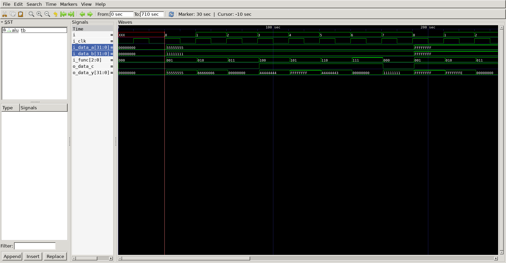

# ALU
## Operation Principle
- Arithmetic Logic Unit

	- fun 000 : A & B
	- fun 001 : A | B
	- fun 010 : A + B
	- fun 011 : not used
	- fun 100 : A & ~B
	- fun 101 : A | ~B
	- fun 110 : A - B
	- fun 111 : SLT

## Verilog Code
### DUT
```verilog

module alu
#(
	parameter	BIT		= 32
)
(
	output reg	[31:0]	o_data_y,
	output 				o_data_c,
	input		[31:0]	i_data_a,
	input		[31:0]	i_data_b,
	input		[2:0]	i_func
);
	wire 	 	[31:0]	data_b_n;
	wire 	 	[31:0]	data_sum;
	

	assign	data_b_n	= (i_func[2] == 1) ? ~i_data_b : i_data_b;

	assign	{o_data_c, data_sum}	= i_data_a + data_b_n;

	always @(*) begin
		case (i_func[1:0])
			2'b00	: o_data_y	= i_data_a & data_b_n;
			2'b01	: o_data_y	= i_data_a | data_b_n;
			2'b10	: o_data_y	= data_sum;
			default	: o_data_y	= i_func[2] ? i_data_a < i_data_b : 'd0;
		endcase
	end

endmodule
	

```

### Testbench
```Verilog
`define CLKFREQ		100
`define SIMCYCLE	10
`define BIT			32

`include "alu.v"

module alu_tb;

// ==================================================================
// DUT Signals & Instantiation
// ==================================================================
	wire	[`BIT-1:0]		o_data_y;
	wire					o_data_c;
	reg		[`BIT-1:0]		i_data_a;
	reg		[`BIT-1:0]		i_data_b;
	reg		[2:0]			i_func;
	reg						i_clk;

	alu
	u_alu
	(
		.o_data_y	(o_data_y	),
		.o_data_c	(o_data_c	),
		.i_data_a	(i_data_a	),
		.i_data_b	(i_data_b	),
		.i_func		(i_func		)
	);	


// ==================================================================
// Clock
// ==================================================================
	always	#(1000/`CLKFREQ)		i_clk = ~i_clk;

// ==================================================================
// Task
// ==================================================================
	task init;
		begin
		i_data_a	= 0;
		i_data_b	= 0;
		i_func		= 0;
		i_clk		= 0;
		end
	endtask

	integer i;
	task test;
		input	[31:0] data_a;
		input	[31:0] data_b;
		begin
			for(i=0; i<8; i++) begin
			#1;
			i_data_a	=  data_a;
			i_data_b	=  data_b;
			i_func		=  i_func + 1'b1;
			repeat(1) @(posedge i_clk);
			end
		end
	endtask

// ==================================================================
// Test Stimulus
// ==================================================================
	integer j;
	initial begin
		init();
		repeat(2) @(posedge i_clk);
		
		test(32'h5555_5555, 32'h1111_1111);
		test(32'hffff_ffff, 32'hffff_ffff);
		test(32'h1111_1111, 32'haaaa_aaaa);
		for(j=0; j<`SIMCYCLE; j++) begin
			test($random, $random);
		end


		repeat(2) @(posedge i_clk);
		$finish;
		
	end

// ==================================================================
// Dump VCD
// ==================================================================
	reg [8*32-1:0] vcd_file;
	initial begin
		if($value$plusargs("vcd_file=%s", vcd_file)) begin
			$dumpfile(vcd_file);
			$dumpvars;
		end else begin
			$dumpfile("alu.vcd");
			$dumpvars;
		end
	end

endmodule

```

## Simulation Result


