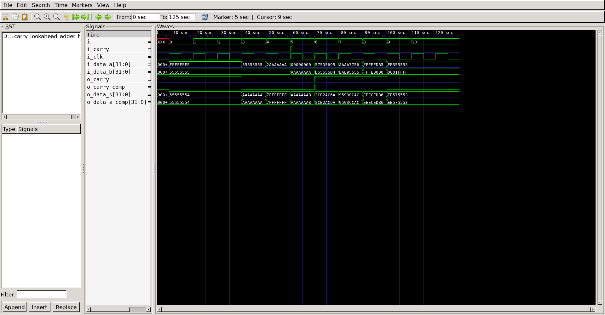

# Carry Lookahead Adder
## Operation Principle

- G[i:j] = G[i] + P[i] (G[i-1] + P[i-1] (G[i-2] + P[i-2]G[j]))
- P[i:j] = P[i]P[i-1]P[i-2]P[j]
- C[i]	 = G[i:j] + P[i:j]C[j-1]

## Verilog Code
### DUT
```verilog

module carry_lookahead_adder
#(
	parameter	BIT		= 32
)
(
	output		[BIT-1:0]		o_data_s,
	output					o_carry,
	input		[BIT-1:0]		i_data_a,
	input		[BIT-1:0]		i_data_b,
	input					i_carry
);
	wire		[(BIT/4)-1:0]		m_data_c;

`ifdef	GENER
	genvar	g;
	generate
		for (g=0; g<BIT/4; g=g+1) begin
			if(g==0) 
				cla_block u_cla_block( m_data_c[g], o_data_s[((g+1)*4)-1:g*4], i_data_a[((g+1)*4)-1:g*4], i_data_b[((g+1)*4)-1:g*4], i_carry);	
			else
				cla_block u_cla_block( m_data_c[g], o_data_s[((g+1)*4)-1:g*4], i_data_a[((g+1)*4)-1:g*4], i_data_b[((g+1)*4)-1:g*4], m_data_c[g-1]);	
		end
	endgenerate

	assign o_carry = m_data_c[BIT-1];

`else
	cla_block u_cla_block1( m_data_c[0], o_data_s[3:0],   i_data_a[3:0],   i_data_b[3:0],   i_carry);	
	cla_block u_cla_block2( m_data_c[1], o_data_s[7:4],   i_data_a[7:4],   i_data_b[7:4],   m_data_c[0]);
	cla_block u_cla_block3( m_data_c[2], o_data_s[11:8],  i_data_a[11:8],  i_data_b[11:8],  m_data_c[1]);
	cla_block u_cla_block4( m_data_c[3], o_data_s[15:12], i_data_a[15:12], i_data_b[15:12], m_data_c[2]);
	cla_block u_cla_block5( m_data_c[4], o_data_s[19:16], i_data_a[19:16], i_data_b[19:16], m_data_c[3]);
	cla_block u_cla_block6( m_data_c[5], o_data_s[23:20], i_data_a[23:20], i_data_b[23:20], m_data_c[4]);
	cla_block u_cla_block7( m_data_c[6], o_data_s[27:24], i_data_a[27:24], i_data_b[27:24], m_data_c[5]);
	cla_block u_cla_block8( o_carry,     o_data_s[31:28], i_data_a[31:28], i_data_b[31:28], m_data_c[6]);
`endif

endmodule

module cla_block
(
	output			o_carry,
	output	[3:0]		o_data_s,
	input	[3:0]		i_data_a,
	input	[3:0]		i_data_b,
	input			i_carry
);
	wire	[2:0]		m_data_c;
	wire	[3:0]		g;
	wire	[3:0]		p;

	assign g[0]		= i_data_a[0] & i_data_b[0];
	assign g[1]		= i_data_a[1] & i_data_b[1];
	assign g[2]		= i_data_a[2] & i_data_b[2];
	assign g[3]		= i_data_a[3] & i_data_b[3];

	assign p[0]		= i_data_a[0] | i_data_b[0];
	assign p[1]		= i_data_a[1] | i_data_b[1];
	assign p[2]		= i_data_a[2] | i_data_b[2];
	assign p[3]		= i_data_a[3] | i_data_b[3];

	assign m_data_c[0]	= g[0] | (p[0] & i_carry);
	assign m_data_c[1]	= g[1] | (p[1] & m_data_c[0]);
	assign m_data_c[2]	= g[2] | (p[2] & m_data_c[1]);
	assign o_carry		= g[3] | (p[3] & m_data_c[2]);

	assign o_data_s[0]	= (i_data_a[0] ^ i_data_b[0]) ^ i_carry;
	assign o_data_s[1]	= (i_data_a[1] ^ i_data_b[1]) ^ m_data_c[0];
	assign o_data_s[2]	= (i_data_a[2] ^ i_data_b[2]) ^ m_data_c[1];
	assign o_data_s[3]	= (i_data_a[3] ^ i_data_b[3]) ^ m_data_c[2];


endmodule

module compare_adder
#(
	parameter	BIT		= 32
)
(
	output	[BIT-1:0]		o_data_s,
	output				o_carry,
	input	[BIT-1:0]		i_data_a,
	input	[BIT-1:0]		i_data_b,
	input				i_carry
);

	assign {o_carry, o_data_s} = i_data_a + i_data_b + i_carry;

endmodule

```

### Testbench
```verilog

`define CLKFREQ		100
`define SIMCYCLE	10
`define BIT			32
`define VEC			10

`include "carry_lookahead_adder.v"

`define GENER
module carry_lookahead_adder_tb;

// ==================================================================
// DUT Signals & Instantiation
// ==================================================================
	wire	[`BIT-1:0]	o_data_s;
	wire				o_carry;
	reg		[`BIT-1:0]	i_data_a;
	reg		[`BIT-1:0]	i_data_b;
	reg					i_carry;
	reg					i_clk;

	carry_lookahead_adder
	#(
		.BIT		(`BIT)
	)
	u_carry_lookahead_adder
	(
		.o_data_s	(o_data_s	),
		.o_carry	(o_carry	),
		.i_data_a	(i_data_a	),
		.i_data_b	(i_data_b	),
		.i_carry	(i_carry	)
	);

	wire	[31:0]	o_data_s_comp;
	wire			o_carry_comp;

	compare_adder
	#(
		.BIT		(`BIT)
	)
	u_compare_adder
	(
		.o_data_s	(o_data_s_comp	),
		.o_carry	(o_carry_comp	),
		.i_data_a	(i_data_a     	),
		.i_data_b	(i_data_b     	),
		.i_carry	(i_carry     	)
	);

// ==================================================================
// TestVector
// ==================================================================
	reg		[`BIT:0]	test_vec	[0:`VEC-1];
	reg		[`BIT:0]	vo_data_s	[0:`VEC-1];
	reg		  	 		vo_carry	[0:`VEC-1];
	reg		[`BIT:0]	vi_data_a	[0:`VEC-1];
	reg		[`BIT:0]	vi_data_b	[0:`VEC-1];
	reg					vi_carry	[0:`VEC-1];

	initial begin
		$readmemb("./test_vec.py",				test_vec);
		$readmemb("./vec_test/o_data.vec",		vo_data_s);
		$readmemb("./vec_test/o_carry.vec",		vo_carry);
		$readmemb("./vec_test/i_data_a.vec",	vi_data_a);
		$readmemb("./vec_test/i_data_b.vec",	vi_data_b);
		$readmemb("./vec_test/i_carry.vec",		vi_carry);
	end

// ==================================================================
// Clock
// ==================================================================
	always	#(500/`CLKFREQ)		i_clk = ~i_clk;

	task init;
		begin
			i_data_a	=	0;
			i_data_b	=	0;
			i_carry		=	0;
			i_clk		=	0;
			@(posedge i_clk);
		end
	endtask

// ==================================================================
// Task
// ==================================================================
	task vectest;
		input	[$clog2(`VEC)-1:0]	i;
		begin
			i_data_a		= vi_data_a[i];
			i_data_b		= vi_data_b[i];
			i_carry			= vi_carry[i];
			@(posedge i_clk);
            if ({o_carry, o_data_s} !== {o_carry_comp, o_data_s_comp}) begin
                $display("Test failed %d: CLA = %h, CMP = %h", i, {o_carry, o_data_s}, {o_carry_comp, o_data_s_comp});
            end else begin
                $display("Test passed %d", i);
            end
		end
	endtask

// ==================================================================
// Test Stimulus
// ==================================================================
	integer	i;
	initial begin
		init();
		
		for (i=0; i<`SIMCYCLE; i++) begin
			vectest(i);
			@(posedge i_clk);
		end

		repeat(2) @(posedge i_clk);
		$finish;
	end

// ==================================================================
// Dump VCD
// ==================================================================
	reg [8*32-1:0] vcd_file;
	initial begin
		if($value$plusargs("vcd_file=%s", vcd_file)) begin
			$dumpfile(vcd_file);
			$dumpvars;
		end else begin
			$dumpfile("carry_lookahead_adder.vcd");
			$dumpvars;
		end
	end


endmodule
```

### Testbench
```python3
#! /usr/bin/python3

import os
import sys
import random

os.getcwd()
os.makedirs('vec_test', exist_ok=True)

file_o_data_s	= './vec_test/o_data_s.vec'
file_o_carry    = './vec_test/o_carry.vec'
file_i_data_a   = './vec_test/i_data_a.vec'
file_i_data_b   = './vec_test/i_data_b.vec'
file_i_carry    = './vec_test/i_carry.vec'

with open(file_o_data_s, 'w') as fh_o_data_s, \
     open(file_o_carry , 'w') as fh_o_carry, \
     open(file_i_data_a, 'w') as fh_i_data_a, \
     open(file_i_data_b, 'w') as fh_i_data_b, \
     open(file_i_carry , 'w') as fh_i_carry:

    simcycle    = 10
    bit         = 32 

    for i in range(simcycle):
        min_int, max_int = 0, (1 << bit) - 1
        int_a = random.randint(min_int, max_int)
        int_b = random.randint(min_int, max_int)
        int_c = random.randint(min_int, 1)
        int_sum = int_a + int_b + int_c

        bin_a = format(int_a, f'0{bit}b')
        bin_b = format(int_b, f'0{bit}b')
        bin_c = format(int_c, '01b')
        bin_sum = format(int_sum, f'0{bit+1}b')

        print(f'--------------------------------------------------')
        print(f'Iteration: {i}')
        print(f'--------------------------------------------------')
        print(f'A   : {bin_a.rjust(bit+1)}')
        print(f'B   : {bin_b.rjust(bit+1)}')
        print(f'C   : {bin_c.rjust(bit+1)}')
        print(f'SUM : {bin_sum.rjust(bit+1)}')
        print(f'--------------------------------------------------')

        fh_o_data_s.write(bin_sum[-bit:] + '\n')
        fh_o_carry.write(bin_sum[0] + '\n')
        fh_i_data_a.write(bin_a + '\n')
        fh_i_data_b.write(bin_b + '\n')
        fh_i_carry.write(bin_c + '\n')

```

## Simulation Result



