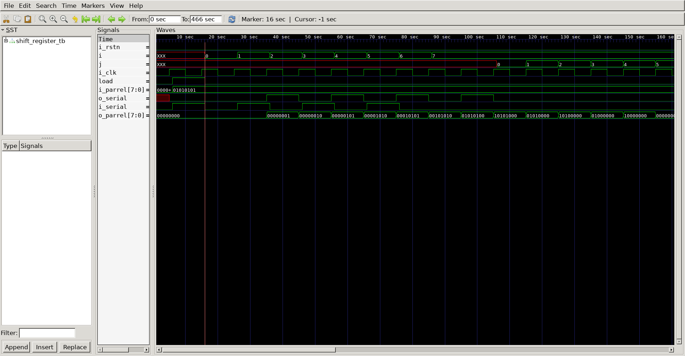
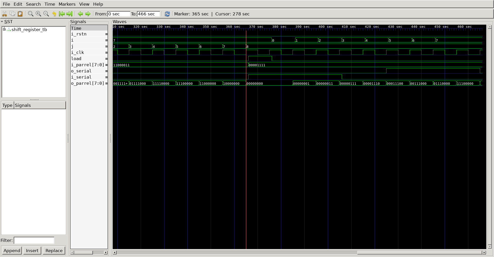

# Shift Register
## Operation Principle
- When Load = 1, acts as a normal N-bit register
- When Load = 0, acts as a shift register
	- Serial tp Parallel converter 
	- Parallel to Serial converter 


## Verilog Code
### DUT
```verilog

module shift_register
(
	output reg	[7:0]	o_parrel,
	output reg		o_serial,
	input			i_serial,
	input		[7:0]	i_parrel,
	input			load,
	input			i_clk,
	input			i_rstn
);
	reg		[7:0]	m_data;

	always @(*) begin
		if(!i_rstn) begin
			o_parrel	<= 8'h0;
			m_data		<= 8'h0;
		end
	end

	always @(posedge i_clk) begin
		if(load == 1)	begin
			m_data		<=  i_parrel;
		end
		else begin
			o_serial	<=  m_data[7];
			m_data		<=  {m_data[6:0], 1'b0};
			o_parrel	<=  {o_parrel[6:0], i_serial};
		end
	end

		
endmodule
```

### Testbench
```verilog

`define CLKFREQ		100
`define SIMCYCLE	10
`define	BIT			8

`include "shift_register.v"

module shift_register_tb;

// ==================================================================
// DUT Signals & Instantiation
// ==================================================================
	wire	[`BIT-1:0]	o_parrel;
	wire				o_serial;
	reg					i_serial;
	reg		[`BIT-1:0]	i_parrel;
	reg					load;
	reg					i_clk;
	reg					i_rstn;

	shift_register
	#(
		.BIT			(`BIT)
	)
	u_shift_register
	(
		.o_parrel		(o_parrel),
		.o_serial		(o_serial),
		.i_serial		(i_serial),
		.i_parrel		(i_parrel),
		.load			(load),
		.i_clk			(i_clk),
		.i_rstn			(i_rstn)
	);

// ==================================================================
// Clock
// ==================================================================
	always	#(500/`CLKFREQ)		i_clk = ~i_clk;

// ==================================================================
// Task
// ==================================================================
	task init;
		begin
			i_serial	=	0;
			i_parrel	=	0;
			load		=	0;
			i_clk		=	0;
			i_rstn		=	0;
			@(posedge i_clk);
		end
	endtask

	integer i;
	task test_load;
		input	[`BIT-1:0]	data;
		begin
			#1;
			load		= 1'b1;
			i_serial	= data[0];
			i_parrel	= data;
			@(posedge i_clk); #1;
			for (i=0; i<`BIT-1; i++) begin
			load		= 1'b0;
			i_serial	= data[i+1];
			@(posedge i_clk); #1;
			end
			repeat(2) @(posedge i_clk); #1;
		end
	endtask

	integer j;
	task test_reset;
		begin
			for (j=0; j<`BIT; j++) begin
			i_serial	<= 1'h0;
			@(posedge i_clk);
			end
		end
	endtask

// ==================================================================
// Test Stimulus
// ==================================================================
	initial begin
		init();
		
		test_load(8'b0101_0101);	
		test_reset();
		test_load(8'b1100_0011);	
		test_reset();
		test_load(8'b0000_1111);	
		
		$finish;
	end

// ==================================================================
// Dump VCD
// ==================================================================
	reg [8*32-1:0] vcd_file;
	initial begin
		if($value$plusargs("vcd_file=%s", vcd_file)) begin
			$dumpfile(vcd_file);
			$dumpvars;
		end else begin
			$dumpfile("carry_lookahead_adder.vcd");
			$dumpvars;
		end
	end


	endmodule
```

## Simulation Result




