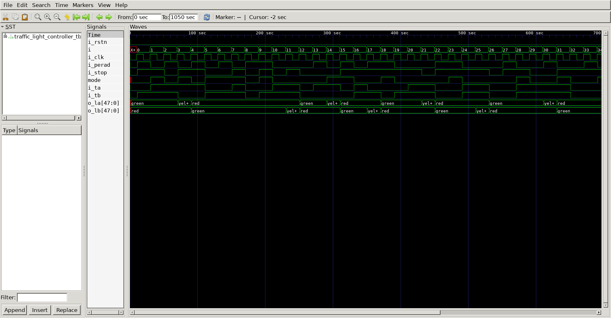

# Mode FSM
## Operation Principle
-When perad = 1, enter perade mode on
-When stop  = 1, enter perade mode off

-When perad_mode = 0 & ta = 1, light change
-When perad_mode = 0 & tb = 1, light change

## Verilog Code
### DUT
```verilog

module mode_fsm
(
	output reg 		mode,
	input			i_perad,
	input			i_stop,
	input			i_clk,
	input			i_rstn
);


	always @(*) begin
		if (!i_rstn)     	  mode <= #1 1'b0;		// s0	
	end

	always @(posedge i_clk) begin
		if (mode == 0) begin
			if (i_perad == 1) mode <= #1 1'b1;		// s1
			else			  mode <= #1 1'b0;	
		end
		else if (mode == 1) begin
			if (i_stop  == 1) mode <= #1 1'b0;		// s0
			else 	  	      mode <= #1 1'b1;
		end
	end

endmodule
		

module light_fsm
(
	output reg	[8*6-1:0]	o_la,
	output reg	[8*6-1:0]	o_lb,
	input					mode,
	input					i_ta,
	input					i_tb,
	input					i_clk,
	input					i_rstn
);
	reg	   		[1:0]		state;

	always @(*) begin
		if (!i_rstn) begin
						state <= #1 2'b0;		// s0
						o_la  <= #1 "green";
						o_lb  <= #1 "red";
		end
	end

	always @(posedge i_clk) begin
		if (state == 0) begin
			if(i_ta == 1 & mode == 0) begin
						state <= #1 2'b1;		// s1
						o_la  <= #1 "yellow";
						o_lb  <= #1 "red";
			end else begin
						state <= state;
		    end
		end
		else if (state == 1) begin
						state <= #1 2'h2;		// s2
						o_la  <= #1 "red";
						o_lb  <= #1 "green";
		end
		else if (state == 2) begin
			if(i_tb == 1 & mode == 0) begin
						state <= #1 2'h3; 		// s3
						o_la  <= #1 "red";
						o_lb  <= #1 "yellow";
			end else begin
						state <= state;
		    end
	    end
		else if (state == 3) begin
						state <= #1 2'h0;		// s0
						o_la  <= #1 "green";
						o_lb  <= #1 "red";
		end
	end

endmodule

```

### Testbench
```verilog

`define CLKFREQ		100
`define SIMCYCLE	50

`include "traffic_light_controller.v"

module traffic_light_controller_tb;

	wire				mode;
	wire [8*6-1:0]		o_la;
	wire [8*6-1:0]		o_lb;
	reg					i_ta;
	reg					i_tb;
	reg					i_stop;
	reg					i_perad;
	reg					i_clk;
	reg					i_rstn;

	mode_fsm
	u_mode_fsm
	(
		.mode		(mode	),
		.i_stop		(i_stop	),
		.i_perad	(i_perad),
		.i_clk		(i_clk	),
		.i_rstn		(i_rstn	)
	);	

	light_fsm
	u_light_fsm
	(
		.o_la		(o_la	),
		.o_lb		(o_lb	),
		.mode		(mode	),
		.i_ta		(i_ta	),
		.i_tb		(i_tb	),
		.i_clk		(i_clk	),
		.i_rstn		(i_rstn	)
	);	

	always	#(1000/`CLKFREQ)		i_clk = ~i_clk;

	task init;
		begin
		i_ta		= 0;
		i_tb		= 0;
		i_stop		= 0;
		i_perad		= 0;
		i_clk		= 0;
		i_rstn		= 0;
		@(posedge i_clk);
		end
	endtask

	integer i;
	initial begin
		init();
		
		for(i=0; i<`SIMCYCLE; i++) begin
		#1;
		i_ta		=  $random;
		i_tb		=  $random;
		i_stop		=  $random;
		i_perad		=  $random;
		repeat(1) @(posedge i_clk);
		end

		repeat(2) @(posedge i_clk);
		$finish;
		
	end

	reg [8*32-1:0] vcd_file;
	initial begin
		if($value$plusargs("vcd_file=%s", vcd_file)) begin
			$dumpfile(vcd_file);
			$dumpvars;
		end else begin
			$dumpfile("traffic_light_controller.vcd");
			$dumpvars;
		end
	end

endmodule
```

## Simulation Result


