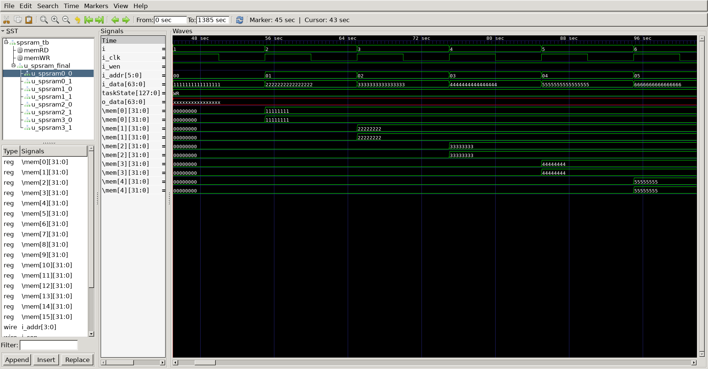
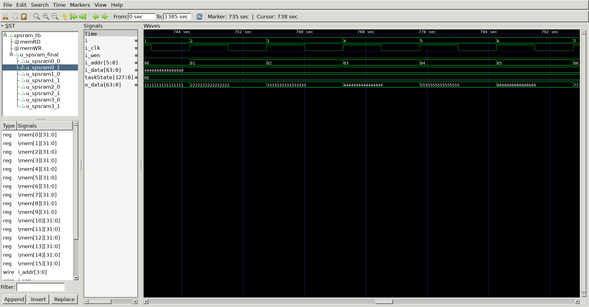

# Spsram
## Operation Principle
- SRAM Unit(spsram) : 4-bit addr & 32-bit I/O Data

- Target (spsram_final) : 6-bit addr & 64-bit I/O Data

## Verilog Code
### DUT
```verilog

module spsram
#(
	parameter	MIF_FILE	= "mif_file.mif",
	parameter	BW_DATA		= 32,
	parameter	BW_ADDR		= 4
)
(
	output		[BW_DATA-1:0]	o_data,
	input		[BW_DATA-1:0]	i_data,
	input		[BW_ADDR-1:0]	i_addr,
	input		            	i_wen,
	input		            	i_cen,
	input		            	i_oen,
	input		            	i_clk
);

// mem wr
	reg		[BW_DATA-1:0]	mem[0:2**BW_ADDR-1];
	`ifdef	MEM_INIT
		initial begin
			$readmemb(MIF_FILE, mem);
		end
	`endif

	always @(posedge i_clk) begin
		if(i_cen && i_wen) begin
			mem[i_addr] <= i_data;
		end else begin
			mem[i_addr] <= mem[i_addr];
		end
	end

// mem rd
	`ifdef	SPSRAM_ASYNC
		assign o_data 	=	!i_oen	  ?	'bz			:
				(i_cen && !i_wen) ?	mem[i_addr]	: 'bx;

	`else
		reg		[BW_DATA-1:0]	o_data;
		always @(posedge i_clk) begin
			if(i_oen) begin
				if(i_cen && !i_wen) begin
					o_data	<=	mem[i_addr];
				end else begin
					o_data	<=	'bx;
				end
			end else begin
				o_data	<=	'bz;
			end
		end
	`endif

endmodule


module spsram_final
#(
	parameter	BW_DATA		= 64,
	parameter	BW_ADDR		= 6
)
(
	output		[BW_DATA-1:0]	o_data,
	input		[BW_DATA-1:0]	i_data,
	input		[BW_ADDR-1:0]	i_addr,
	input		            	i_wen,
	input		            	i_clk
);

spsram u_spsram0_0( o_data[31:0],  i_data[31:0],   i_addr[3:0], i_wen, !i_addr[5] & !i_addr[4], !i_addr[5] & !i_addr[4], i_clk);
spsram u_spsram0_1( o_data[63:32], i_data[63:32],  i_addr[3:0], i_wen, !i_addr[5] & !i_addr[4], !i_addr[5] & !i_addr[4], i_clk);
spsram u_spsram1_0( o_data[31:0],  i_data[31:0],   i_addr[3:0], i_wen, !i_addr[5] &  i_addr[4], !i_addr[5] &  i_addr[4], i_clk);
spsram u_spsram1_1( o_data[63:32], i_data[63:32],  i_addr[3:0], i_wen, !i_addr[5] &  i_addr[4], !i_addr[5] &  i_addr[4], i_clk);
spsram u_spsram2_0( o_data[31:0],  i_data[31:0],   i_addr[3:0], i_wen,  i_addr[5] & !i_addr[4],  i_addr[5] & !i_addr[4], i_clk);
spsram u_spsram2_1( o_data[63:32], i_data[63:32],  i_addr[3:0], i_wen,  i_addr[5] & !i_addr[4],  i_addr[5] & !i_addr[4], i_clk);
spsram u_spsram3_0( o_data[31:0],  i_data[31:0],   i_addr[3:0], i_wen,  i_addr[5] &  i_addr[4],  i_addr[5] &  i_addr[4], i_clk);
spsram u_spsram3_1( o_data[63:32], i_data[63:32],  i_addr[3:0], i_wen,  i_addr[5] &  i_addr[4],  i_addr[5] &  i_addr[4], i_clk);


endmodule


```

### Testbench
```verilog

`define CLKFREQ		100
`define BW_ADDR		4

`define SPSRAM_ASYNC
`define MEM_INIT

`include "spsram.v"

module spsram_tb;

// ==================================================================
// DUT Signals & Instantiation
// ==================================================================
	wire	[63:0]		o_data;
	reg		[63:0]		i_data;
	reg		[5:0]		i_addr;
	reg					i_wen;
	reg					i_clk;
	
spsram_final u_spsram_final( o_data,  i_data, i_addr, i_wen, i_clk);

// ==================================================================
// Clock
// ==================================================================

	always	#(500/`CLKFREQ)		i_clk = ~i_clk;

// ==================================================================
// Task
// ==================================================================
	reg		[4*32-1:0]	taskState;

	task init;
		begin
			i_data		= 0;
			i_addr		= 0;
			i_wen		= 0; 
			i_clk		= 0;
			taskState	= 0;
		end
	endtask
	
	task memWR;
		input	[5:0]	ti_addr;
		begin
			@(posedge i_clk) begin
				taskState	= "WR";
				i_data		= i_data + 64'h1111_1111_1111_1111;
				i_addr		= ti_addr;
				i_wen		= 1;
			end
		end
	endtask

	task memRD;
		input	[5:0]	ti_addr;
		begin
			@(posedge i_clk) begin
				taskState		= "RD";
				i_addr			= ti_addr;
				i_wen			= 0;
			end
		end
	endtask

// ==================================================================
// Test Stimulus
// ==================================================================
	integer	i;
	initial begin
		init();
		#(4*1000/`CLKFREQ);
		
		for (i=0; i<64; i++) begin
			memWR(i);
		end

		repeat(5) @(posedge i_clk);
		for (i=0; i<64; i++) begin
			memRD(i);
		end

		repeat(2) @(posedge i_clk);
		$finish;
	end
	
// ==================================================================
// Dump VCD
// ==================================================================
	reg [8*32-1:0] vcd_file;
	initial begin
		if($value$plusargs("vcd_file=%s", vcd_file)) begin
			$dumpfile(vcd_file);
			$dumpvars;
			for (i=0; i<2**`BW_ADDR; i++) begin
				$dumpvars(0, u_spsram_final.u_spsram0_0.mem[i]);
				$dumpvars(0, u_spsram_final.u_spsram0_1.mem[i]);
				$dumpvars(0, u_spsram_final.u_spsram1_0.mem[i]);
				$dumpvars(0, u_spsram_final.u_spsram1_1.mem[i]);
				$dumpvars(0, u_spsram_final.u_spsram2_0.mem[i]);
				$dumpvars(0, u_spsram_final.u_spsram2_1.mem[i]);
				$dumpvars(0, u_spsram_final.u_spsram3_0.mem[i]);
				$dumpvars(0, u_spsram_final.u_spsram3_1.mem[i]);
			end
		end else begin
			$dumpfile("spsram.vcd");
			$dumpvars;
		end
	end
endmodule


```

## Simulation Result



